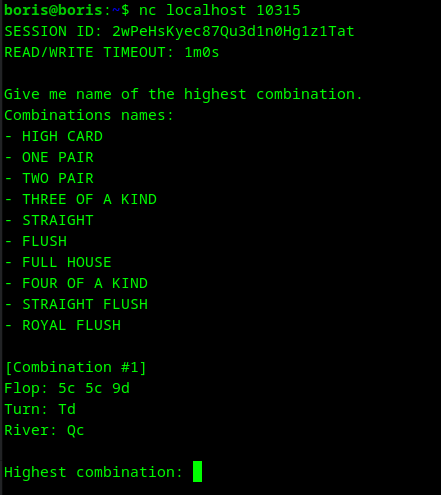
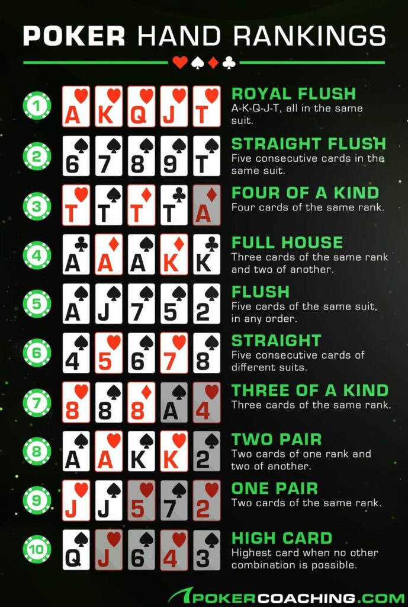

# holdem | easy | ppc

## Информация

> `nc <ip> 10315`

## Деплой

```sh
cd deploy
docker-compose up --build -d
```

## Выдать участинкам

Ничего

## Описание

Даётся 5 карт нужно определить сильнейшую покерную комбинацию.

## Решение

Подключаемся к сервису с помощью netcat или любого другого клиента, видим сообщение:


Нам даётся список названий комбинаций, Flop, Turn и River, а в них какие-то значения 5c, 5c, 9d, Td, Qc и т.д.
Догадываемся (или нагугливаем), что это покер. Ищем как в покере определяются комбинации и разбираемся в покерной нотации.  
Находим примерно такую картинку с комбинациями:


Запрогиваем это и получаем флаг.

Пример решения с помощью python + pwntools:
[solve.py](solve/solve.py)

## Флаг

`goctf{holdem_holdem_i_wanna_be_a_gundam_bb7a}`

