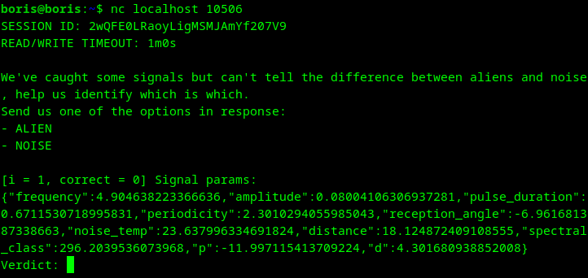

# signal | medium | ppc

## Информация

> `nc <ip> 10506`

## Деплой

```sh
cd deploy
docker-compose up --build -d
```

## Выдать участинкам

Ничего

## Описание

Обучаем бинарный классификатор определять инопланетные сигналы.

## Решение

Подключаемся к сервису с помощью netcat или любого другого клиента, видим сообщение:


Нам нужно отличить инопланетные (ALIEN) сигналы, от шума (NOISE). Задача сводится к бинарной классификации,
можно решить разными способами, ниже решение с помощью нейронки.

Решение делится на 3 части:
- [collect.py](solve/collect.py) - собираем данные для обучения модели;
- [train.py](solve/train.py) - обучаем модель;
- [solve.py](solve/solve.py) - решаем таску используя обученную модель;

## Флаг

`goctf{bin4ry_class1f1cat1on_jus7_us3_1m4g1n4t10n}`

