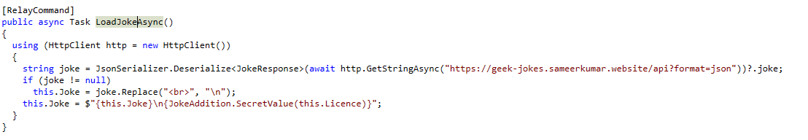

# AEStrap
TODO: нормально описать
### Сложность

Medium

### Информация

```

Формат флага GOCTF{}

```

### Описание

таск-матрешка на реверс dll и ключей aes

### Запуск

### Выдать учаcтникам

public/

### Решение

### Решение


На странице присутствует скрытое поле ввода. Оно становится видимым только после 10 нажатий на определённую кнопку.

  


Далее в клиентской логике находим метод, вызываемый по кнопке, — он маскируется под получение шутки, но фактически задействует скрытую функциональность.



В коде также присутствует зашифрованная DLL и два блока с ключами.


Ключи перемешаны — порядок задаётся с помощью отдельных массивов.


Геттеры и сеттеры восстанавливают ключ, затем вызывается метод для дешифрации.


После дешифрации вызывается функция из DLL, содержащая финальную логику.


Проанализировав дешифрованную dll мы сможем найти флаг

### Флаг

GOCTF{S3cr31_f4nc1i0n_1n_D11!}
